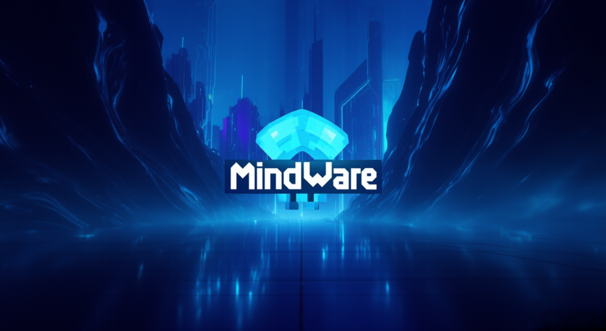
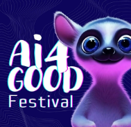

# Jeu vidéo MindWare 
MindWare est un jeu narratif en 2D (type visual novel) qui plonge le joueur dans un univers numérique où ses choix déterminent sa relation avec la technologie. Inspiré d’un style à la croisée du cartoon, du pixel art léger, et du futurisme élégant, le jeu propose plusieurs scénarios de fin selon les décisions prises.

## Synopsis 
Dans un futur proche, la frontière entre vie réelle et numérique est plus floue que jamais. Tu incarnes un·e utilisateur·rice connecté·e qui doit naviguer à travers des dilemmes éthiques, sociaux et personnels autour de l’usage des technologies. Apprivoiseras-tu le digital, ou te laisseras-tu submerger par lui ?

  

## Installation
Pour pouvoir jouer au jeu, vous pouvez l'installer sur le lien suivant : https://mathieubaba.itch.io/mindware

Un fichier .exe se trouvera ensuite dans le dossier .zip décompréssé.

## AI4GOOD Festival
Ce jeu a été développé dans le cadre du AI4GOOD festival. Cette une organisation à but non lucratif initie les jeunes à l’utilisation de l’intelligence artificielle pour créer des courts-métrages et jeux vidéo, pour qu’ils développent leurs compétences tout en s’engageant sur des enjeux sociaux majeurs.

  

## Les Intelligences artificielles utilisées 
* Pour le scénario : 
  - ChatGPT
    
* Pour la génération d'images :
  - Kling AI
  - Gamma
  - Lummi
  - Freepik
  - Microsoft Copilot

* Pour la voix :
  - EvenLabs

* Pour les ajustements d'images :
  - removebg
  - pixelcut ai

# Auteur
**Math-Baba** - [GitHub](https://github.com/Math-Baba)
